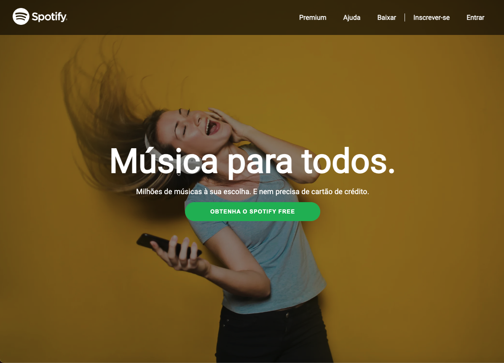
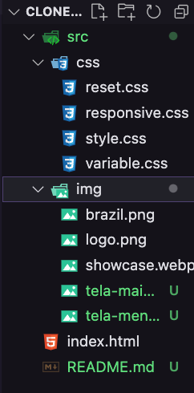

# Desafios Guiados - Ima Tech
## Clone do Spotify - Projeto Guiado (Front-End)

Este é um projeto guiado oferecido pela Ima Tech com o objetivo de criar um clone da interface do Spotify. 

Algumas modificações foram implementadas, como a criação e organização de pastas, além da separação de arquivos css. 

Outra distinção neste projeto é a abordagem responsiva, garantindo funcionamento em diversos dispositivos e resoluções de tela.

